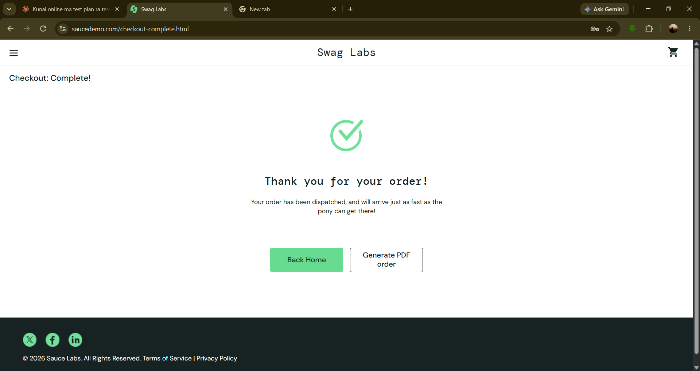

# Manual Testing of the SauceDemo Web Application

Manual QA documentation for the SauceDemo (Swag Labs) demo e-commerce site: **https://www.saucedemo.com**

This repository contains a complete manual testing cycle, from the test plan to the final summary report.

**Tester:** Aavash Joshi | **Type:** Manual functional testing | **Environment:** Google Chrome on Windows 11 | **Test period:** 22–24 September 2026

---

## Results at a glance

| Metric | Value |
|---|---|
| Test cases executed | 79 |
| Passed | 59 |
| Failed | 20 |
| Pass rate | 75% |
| Unique defects reported | 15 |
| Severity split | 1 Critical, 10 Major, 4 Minor |

---

## What is in this repository

| File | Description |
|---|---|
| `Test_Plan_SauceDemo.pdf` | Scope, strategy, test design techniques, environment, schedule, STLC entry and exit criteria, severity and priority levels |
| `Test_Cases_SauceDemo.xlsx` | 79 test cases across six sheets: Login, Products, Cart, Checkout, Menu and Footer, Demo Users |
| `Bug_Report_SauceDemo.xlsx` | 15 defects with test case ID, steps to reproduce, expected and actual result, severity, priority and screenshot reference |
| `Test_Summary_Report_SauceDemo.pdf` | Execution summary, defect summary, exit criteria evaluation, observations and recommendations |
| `screenshots/` | Evidence for each reported defect |

---

## Modules covered

| Module | Test cases | Passed | Failed |
|---|---|---|---|
| Login | 15 | 13 | 2 |
| Products | 12 | 11 | 1 |
| Cart | 12 | 11 | 1 |
| Checkout | 16 | 14 | 2 |
| Menu and Footer | 10 | 9 | 1 |
| Demo Users | 14 | 1 | 13 |
| **Total** | **79** | **59** | **20** |

The Demo Users sheet covers the six accounts the application provides (standard, locked out, problem, performance glitch, error and visual user). Almost every defect was found by comparing these users against the behaviour of `standard_user`.

---

## Sample test case

| Field | Details |
|---|---|
| Test Case ID | TC_CHK_015 |
| Module | Checkout |
| Description | Verify checkout without any product in the cart |
| Precondition | The user is logged in and the cart is empty |
| Test Steps | 1. Click the cart icon  2. Click Checkout  3. Fill the information and click Continue  4. Click Finish |
| Expected Result | The application should not allow an order to be placed when the cart is empty |
| Actual Result | The Checkout: Complete page opens with the thank you message |
| Status | Fail |
| Priority | High |

---

## Key defects found

| Bug ID | Severity | Summary |
|---|---|---|
| BUG_015 | Critical | For `error_user`, clicking Finish on the Overview page does nothing, so the order can never be completed |
| BUG_012 | Major | An order can be placed with an empty cart; the total shows $0.00 and the order still completes |
| BUG_014 | Major | Checkout continues to the Overview page even when the Last Name field is empty, with no error message |
| BUG_011 | Major | For `visual_user`, prices on the Products page do not match the prices in the cart ($1.77 vs $29.99) |
| BUG_004 | Major | For `problem_user`, every letter typed in the Last Name field is written in the First Name field |
| BUG_008 | Major | For `error_user`, sorting shows the message "Sorting is broken!" and the products are not sorted |
| BUG_013 | Minor | After Reset App State the cart is cleared, but the product buttons still show Remove |

Full details, steps to reproduce and screenshots are in the bug report.

---

## Evidence

*An order is completed successfully even though the cart is empty and the total is $0.00 (BUG_012).*

---

## Tools used

- Microsoft Excel for test cases and the bug report
- Microsoft Word for the test plan and the summary report
- Chrome DevTools for responsiveness checks
- Snipping Tool for defect evidence

---

## What this project shows

- Writing a test plan from scratch when no requirement document is available
- Designing positive and negative test cases using equivalence partitioning, boundary value analysis, decision tables and state transition
- Executing test cases and recording results with traceability between test cases and defects
- Reporting defects with clear reproduction steps, severity and priority
- Summarising the outcome and making a release recommendation based on exit criteria
